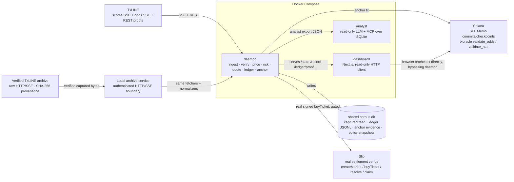
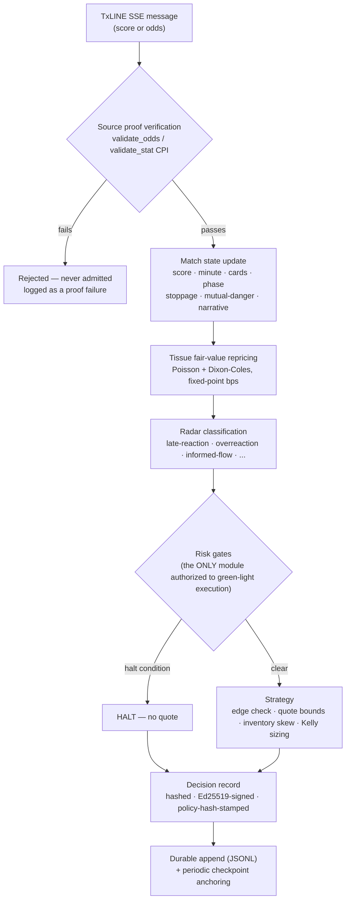
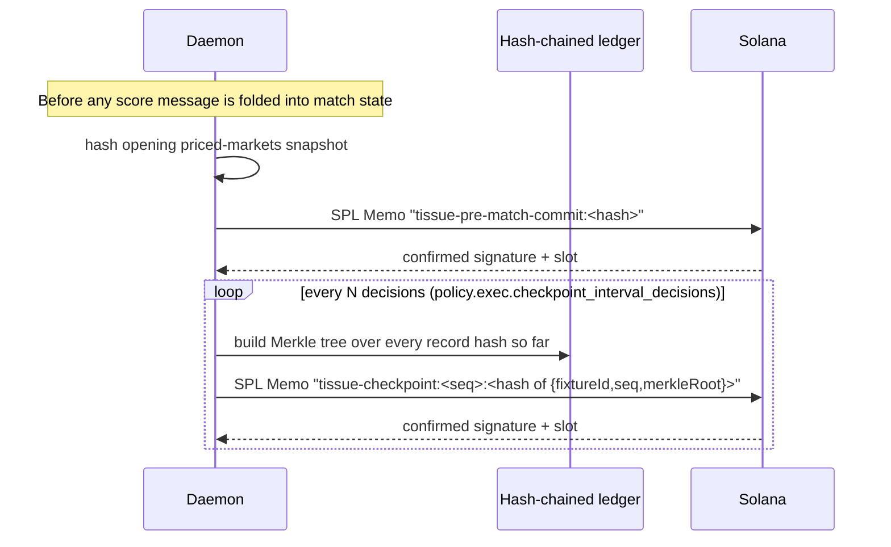
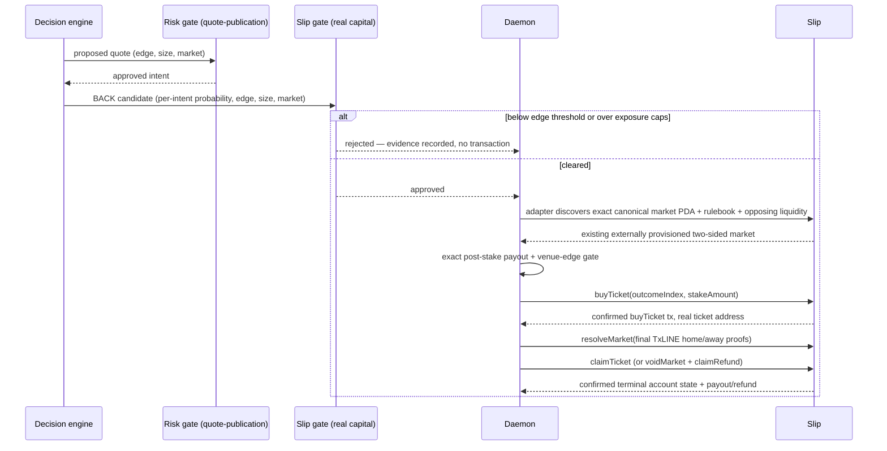
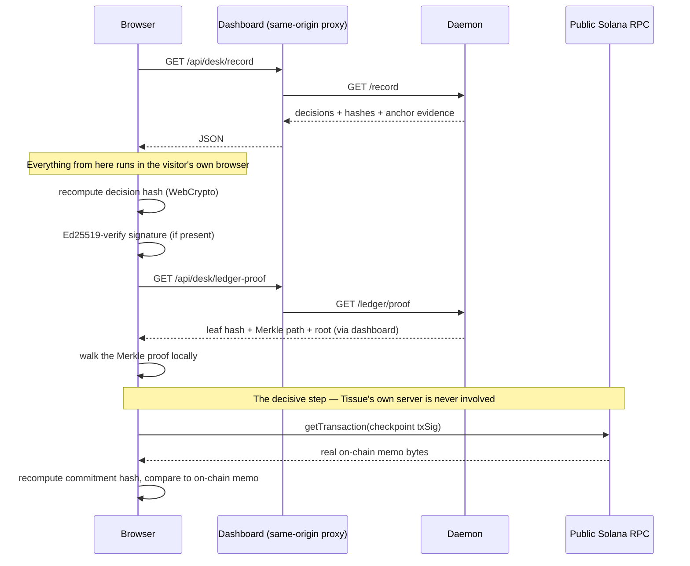

# Tissue — Architecture

An autonomous in-play fair-value and quote-policy desk for live football, built on
TxLINE's live scores/odds feeds and anchored on Solana. This document is the system-level
map: processes, data flow, on-chain evidence, and verification — written to be read
alongside the code, not instead of it.

Companions: [`docs/`](docs/README.md) (Mintlify reference docs), [`HANDOFF.md`](HANDOFF.md)
(project history), [`feedback.md`](feedback.md) (real findings from live integration).

## 1. Topology

Three services, one shared evidence store, two on-chain surfaces.

Three invariants the runtime enforces, not just documents:

1. **No synthetic fallback in live mode.** `TISSUE_MODE=live` is required; there is no
   `synthetic` mode. A missing credential or feed outage fails loudly at boot or halts
   the desk — it never substitutes fabricated data.
2. **The dashboard cannot write anything.** It only ever calls the daemon's deliberately
   scoped, read-only HTTP/SSE API. It has no database credentials of any kind.
3. **The analyst is read-only by construction, not convention.** Its SQLite connection is
   opened with `readOnly: true` at the driver level, and no write/execute/post tool
   exists anywhere in its tool registry — tested, not just claimed
   (`apps/analyst/src/adversarial.test.ts`).
4. **Historical replay does not bypass ingestion.** The workspace archive is immutable;
   adjacent provenance must match byte length and SHA-256 before a local authenticated
   service will serve captured JSON/SSE. Production snapshot fetchers and normalizers consume
   that service. Reports label the July 14 capture as historical and never as current-live.

## 2. The decision pipeline

Every feed message — live or replayed — passes through the same ordered pipeline. This
is the single most load-bearing fact in the whole system: replay and live share the
literal same `createEngineSession`/`runEngine` implementation, not two implementations
kept in sync by discipline.

Halt conditions checked by the risk gate, in the order they can fire: feed-gap,
unexplained-movement, informed-flow, model-divergence, drawdown-kill (per-fixture and
portfolio-wide), and the aggregate proof-failure-rate circuit breaker (distinct from a
single rejected message — this one fires on a *rate* of recent failures, signaling a
degraded proof service rather than one bad message).

## 3. The five pricing regimes

Each regime is an individually toggleable heuristic layered onto the Dixon-Coles core,
addressing one specific, real trading question. All five are neutralized in the Strategy
Arena's baseline agent and can be isolated one at a time via the regime ablation matrix.

| Regime | Question it answers |
|---|---|
| Stoppage-time | How should added time be priced without zeroing goal probability at minute 90? |
| Mutual-danger | How should sustained two-way pressure be priced when the next-goal distribution is bimodal? |
| Narrative regime | Is the market's own recent behavior itself informative? |
| Informed-flow | Is this price move unusually sharp for *this* market's own trailing distribution? |
| Stale-quote decay | Should an unchallenged resting quote tighten over time? |

## 4. On-chain anchoring

Two independent, real SPL Memo mechanisms, both from the daemon's own operator keypair —
Solana is the trust and timestamping layer here, not a counterparty. Real order execution
does exist, on a separate venue (Slip, §5), because TxLINE's own `txoracle` program has no
order or execution instructions at all (§8).

The head hash of the ledger already commits to its entire prefix (`linkHash` folds every
prior record in), so anchoring a checkpoint is equivalent to anchoring a root over
everything decided so far — continuous on-chain evidence through the match, not a single
pre-kickoff snapshot.

Separately, every score and odds message is checked against TxLINE's own Merkle proof
endpoints and validated on-chain (`validate_odds` / `validate_stat`) **before** it can
enter the pipeline at all (§2) — this is *input* verification, distinct from the
*commitment* anchoring above.

## 5. Venue execution boundary; Slip is the only enabled adapter

**FullTime creates the conversation. Slip turns it into an agreement. Tissue finds the fair price and trades it across supported markets.**

The shared `exec/venue.ts` contract separates normalized market identity and discovery,
fair-value comparison, venue fee/liquidity economics, capital authorization, signed
submission, confirmation/reconciliation, settlement/claim, and durable evidence. The daemon
currently registers exactly one implementation: `SlipVenueAdapter`. External sports-market
venues such as Polymarket and other order books remain future adapters; Tissue exposes no
control, liquidity, execution result, or success claim for them. The pricing side likewise
supports only its implemented market families, presently 1X2 and totals—not arbitrary
FullTime or Slip questions.

TxLINE's own on-chain program (`txoracle`) is a data-oracle/subscription/validation
program — `subscribe`, `validate_odds`, `validate_stat`, `insert_*_root`, pricing-matrix
admin — with no order-book or execution instruction anywhere in it (confirmed against the
live IDL, not assumed). The risk-gated quote-publication API (§2) was always the ceiling of
what TxLINE itself makes possible. Real execution instead lands on Slip, a separate,
real pari-mutuel settlement venue: a decision that already cleared the ordinary risk gate
(§2) is evaluated against a second, stricter, off-by-default capital-risk gate
(`policy.exec.slip`, `risk/gates.ts::evaluateSlipExecution` — its own edge threshold and
exposure caps, because publishing a recommendation and signing a transaction that spends
funds are not the same risk decision), then turned into a real signed, confirmed
transaction with the same keypair used for on-chain anchoring above.

Slip's market model is pool-based (stake into an outcome band before `entryDeadline`,
resolve from a real TxLINE score proof, claim) — structurally different from the
intent-book shape the replay `ExecPort` uses (`postIntent`/`replaceIntent`/`cancelIntent`),
so this is a parallel execution path alongside quote-publication, not a replacement for it.
Every candidate is BACK-only and retains its exact Tissue probability/TxLINE edge. Before a
localnet/devnet buy, the adapter recomputes post-stake pools, fees, payout, break-even
probability, and venue edge; the dashboard journals those economics. Mainnet is deliberately
disabled because Slip's current `buyTicket` instruction cannot atomically enforce a minimum
payout. A read-then-buy check is not slippage protection under concurrent transactions.
The daemon deliberately refuses to create and self-fill an empty pool: Slip voids a market
unless at least two outcomes are funded, so that path is not a defensible trade. Rehearsed
end-to-end through the venue-adapter boundary (independent provision + opposing stake → Tissue buy → resolve from a real score proof → claim, with
independent on-chain balance checks) against a local Surfpool instance running the real
compiled Slip program (`vendor/slip-program-7gNEn.so`) —
`apps/daemon/src/exec/slipExec.surfpool.test.ts`.
The same packed consumer independently detects the hardened public devnet deployment's
unified capability marker and decodes its real markets; this public check is read-only and
is not presented as a second owner-funded write lifecycle.

## 6. Verification — how a third party checks any of this

The daemon exposes a real Merkle-proof primitive (`/ledger/proof`); the dashboard wraps
it in a client-side verifier that never trusts Tissue's own server for the decisive step.

A compromised or lying daemon cannot pass this check by returning `{ ok: true }` — every
step is independently recomputable, and the final comparison is against transaction
bytes fetched directly from a public RPC the daemon never touches.

`/record` (the public export), `/ledger/proof` (Merkle inclusion proofs), `/verify`
(server-computed hash-chain status — useful as a quick check, not the trust boundary),
and `/policy/snapshots` (signed policy change log) are the full read-only evidence
surface. See [`docs/verifiability.mdx`](docs/verifiability.mdx) for the complete
specification.

## 7. Testing strategy

Every layer above has a corresponding real test — not a mock of the unit under test.

- **Default suite** (364 tests passing across Slip, daemon, analyst, and dashboard; 10
  explicitly external/local-chain cases gated): includes adversarial
  suites that feed the ingest pipeline and the analyst's LLM+MCP loop deliberately
  malformed or hostile input, asserting the system fails closed. This is how real bugs were
  found and fixed during hardening — NaN-poisoned odds consensus; a blank fallback answer
  in the analyst's tool-loop limit; and a stale-codegen bug in a vendored SDK that silently
  corrupted every Slip transaction it built (§5) — see the
  [changelog](docs/feedback-roadmap.mdx#changelog).
- **Local Solana anchoring tests** (opt-in, `test:surfpool`): real transaction-level
  scenarios against a local Surfpool validator — confirmation, insufficient balance,
  unreachable RPC, concurrent submissions — without racing public devnet's rate limits.
- **Local Slip execution test** (opt-in, `test:slip:surfpool`): the full real lifecycle —
  independently provision a two-sided market, buy an exact atomic stake, resolve from a
  protocol-valid score proof, claim, and retry idempotently — against a local Surfpool
  instance running the actual compiled Slip program, with independent on-chain balance
  checks at each step.
- **Dashboard E2E** (opt-in, `test:e2e`): real Chromium against a real Next.js server,
  every page under every desk status, via a fake daemon HTTP process.
- **Process-level chaos drills** (opt-in, real credentials required): `drill:restart`
  SIGKILLs the compiled daemon mid-stream and asserts the persisted hash chain survives a
  hard crash; `drill:streamdrop` severs the SSE connections without killing the process
  and asserts real reconnect.

## 8. What Tissue never does

- **Never invents a fill, a counterparty, or PnL within the TxLINE/quote-publication book.**
  `txoracle` has no intent-book or order-matching instruction of its own; simulated fills
  there exist solely in replay/research mode and are labeled `simulated` everywhere they
  surface. Real execution on Slip (§5) is a separate, explicit, off-by-default path — real
  capital, gated by its own stricter risk check, never a substitute counterparty invented
  inside the quote-publication book itself.
- **Never falls back to synthetic data in live mode.** A missing credential or feed
  outage is a loud failure, not a silent substitution.
- **Never lets an LLM influence a decision.** The analyst is read-only by construction
  (tested), has no write tool, and no tool spec advertises write/execute capability to
  the model in the first place.
- **Never mutates strategy parameters autonomously.** `policy.toml` is the single source
  of truth for every tunable constant; tuning suggestions (`evaluate:tuning`) are
  human-reviewed and never auto-applied.

---

Built for the TxODDS World Cup Hackathon, Trading Tools and Agents track · data by
[TxLINE](https://txline.txodds.com), anchored on Solana.
